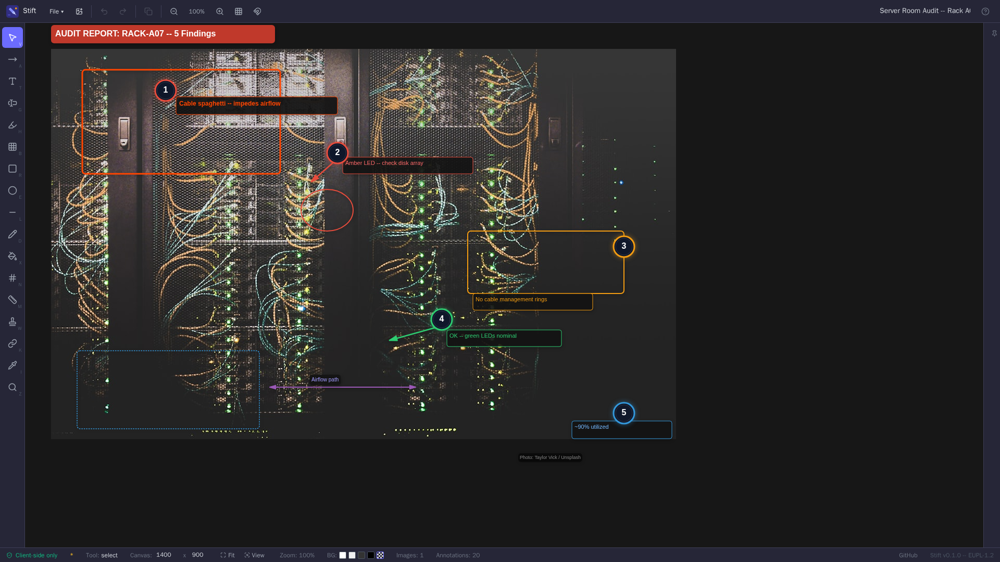
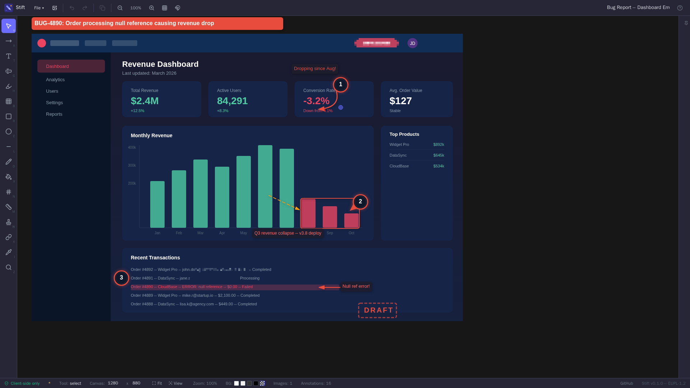
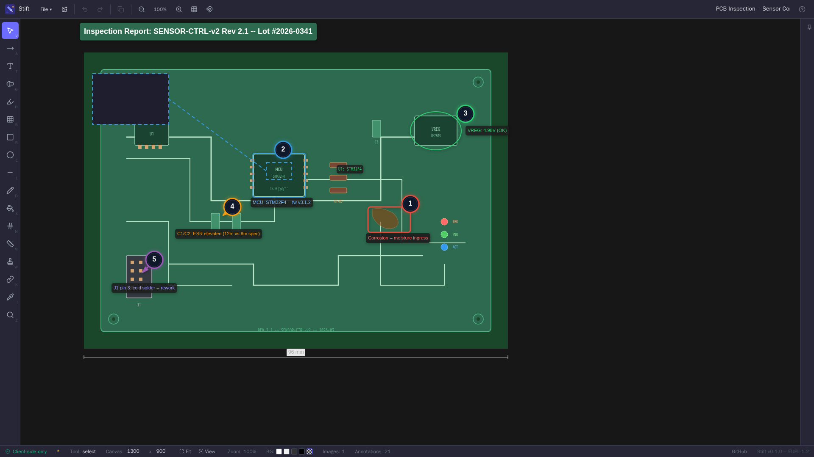
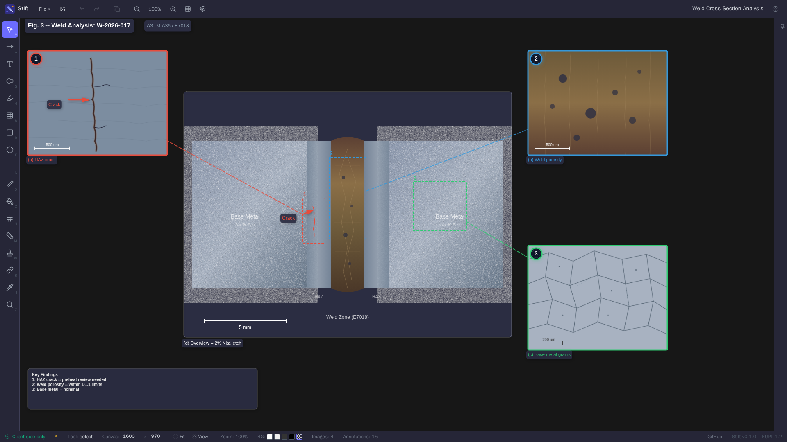
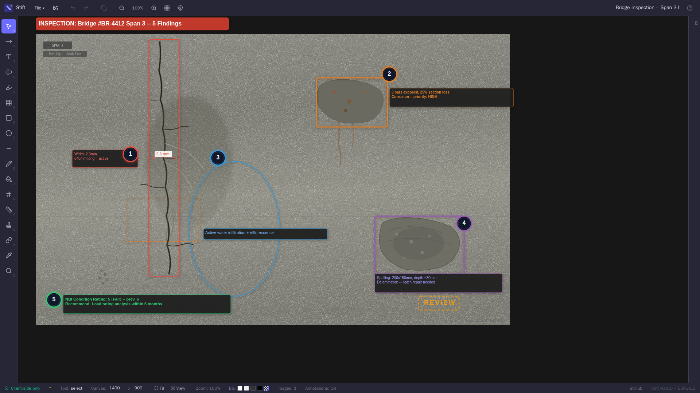
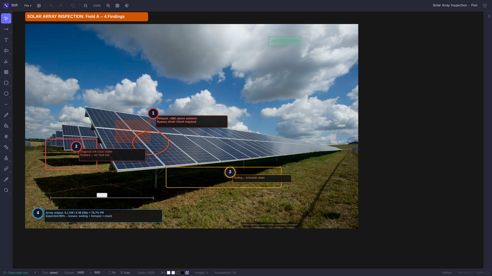

<p align="center">
  
</p>

<h1 align="center">Stift</h1>

<p align="center"><strong>Free, open-source image annotation and compositing.</strong></p>

<p align="center">Annotate screenshots and compose multi-image figures, directly in the browser, with no data ever leaving your machine.</p>

<p align="center"><a href="https://stift.io"><strong>Live demo at stift.io</strong></a></p>

<p align="center">
  
</p>

Built for people who work with confidential materials: internal bug reports, hardware inspections, failure analyses, architecture diagrams, or anything else that shouldn't end up on someone else's server.

Stift focuses on the essential tools you need to get the job done, without the complexity or cost of commercial alternatives. It's not trying to be Photoshop. It's trying to be the fastest path from "I need to annotate this screenshot" to "here's the report-ready image."

<details>
<summary><strong>More examples</strong> (click to expand)</summary>

<br>

| Bug Report | PCB Inspection |
|:---:|:---:|
|  |  |

| Weld Cross-Section Analysis | Bridge Inspection |
|:---:|:---:|
|  |  |

| Solar Array Inspection |
|:---:|
|  |

All examples are built-in and can be loaded from the onboarding screen.

</details>

<p align="center">
  <strong>Made in Germany 🇩🇪.</strong><br>
  Licensed under the <strong>European Union Public Licence (EUPL-1.2)</strong>.<br>
  Privacy first. Open source.
</p>

---

## Key Features

**Annotation tools** (16 tools, each with a single-key shortcut):

- Arrows (single/double-head, solid/dashed/dotted), text labels, text boxes with auto-sizing borders
- Highlight regions, blur/pixelate sensitive areas
- Rectangles, ellipses, lines (solid/dashed/dotted), freehand drawing
- Auto-incrementing numbered counters with optional tapered tails
- Dimension/measurement lines with unit calibration
- Stamp/watermark annotations (DRAFT, APPROVED, REJECTED, or custom text)
- Color boxes for redaction
- Connectors linking overview regions to detail images
- Eyedropper (pick any color from the canvas)
- Magnifier (draw a source region, get an enlarged inset with connecting line)
- Font selection (sans-serif, serif, monospace, Arial, Georgia)

**Professional output:**

- Auto-sized text boxes with uniform padding and colored borders
- Drop shadows, rounded corners, consistent visual style
- Dark counter badges with colored rings
- Dimension lines with end caps and labeled measurements

**Image manipulation:**

- Crop, rotate, brightness/contrast adjustment
- Lock images to prevent accidental displacement
- Position, size, and rotation via numerical inputs or handles

**Canvas & workflow:**

- Space+drag to pan, scroll to zoom, zoom-to-fit, pinch-to-zoom (touch)
- Snap-to-grid, canvas size control, background color (white/dark/transparent)
- Multi-select (Shift+click), Ctrl+A, arrow key nudge (1px / Shift+10px)
- Group/ungroup annotations (Ctrl+G / Ctrl+Shift+G), lock annotation position
- Shift-constrain: 15-degree angle snap for lines, square/circle for shapes, proportional resize
- Curved bezier arrows with draggable control point
- Copy/paste (Ctrl+C/V), duplicate (Ctrl+D), layer ordering (]/[)
- Right-click context menu with alignment tools (align edges, distribute, center)
- Undo/redo (Ctrl+Z/Y), inline text editing (double-click)
- Auto-save every 30 seconds with crash recovery dialog
- Drag-and-drop `.stift` project files to open

**Storage & compression:**

- **Local save**: full original resolution, no compression, no size limits
- **Server save** (optional): images auto-compressed to WebP, then end-to-end encrypted client-side before upload. See [docs/SECURITY.md](docs/SECURITY.md)

**Export** (all generated in-browser, nothing uploaded):

- PNG (1x or 2x), JPG (high/medium quality), PDF (canvas, A4, Letter)
- Transparent PNG (set canvas background to transparent)
- LaTeX: `.png` + `.tex` with tikz overlays using your document's native font

---

## Getting Started

The only requirement is Docker.

```bash
git clone <repository-url>
cd stift
docker compose up
```

Open **http://localhost:8080** in your browser. A guided onboarding walks you through all tools and lets you load example projects.

To use a different port:

```bash
PORT=9090 docker compose up
```

### Ports at a glance

| Port | Where | What |
|------|-------|------|
| `8080` | host (default) | The only port you connect to. Override with `PORT` env. |
| `80` | inside the container | nginx, serves the SPA and proxies `/api/*` to the Node API |
| `3001` | inside the container, `127.0.0.1`-only | Node API, never exposed; nginx fronts it |

The Node API binds `127.0.0.1` only and is reachable solely through nginx on the same container. The host port mapping (`PORT:80`) is the only knob; there is no separate API port to expose or firewall.

---

## Network exposure ⚠

> **Stift is designed for use on internal / trusted networks** (your LAN, a VPN, an office subnet). The default `docker-compose.yml` exposes the app on a plain HTTP port with no transport encryption, no rate limiting, and no abuse protection beyond the basic per-user quotas. That is appropriate for an internal tool.
>
> **If you expose Stift to the public Internet, you MUST put it behind a reverse proxy that provides HTTPS.** Visitors entering passwords over plain HTTP would expose them to anyone on the network path; without a proxy, the integrity of every cloud-saved (encrypted) project depends on the integrity of the connection it was uploaded over.

For public-Internet deployments, use the included `docker-compose.proxied.yml`, which puts [Caddy](https://caddyserver.com/) in front of Stift with automatic HTTPS via Let's Encrypt:

```bash
# 1. Point your DNS at the host (A/AAAA record).
# 2. Make sure ports 80 and 443 are reachable from the public Internet.
# 3. Create a .env file:
cat > .env <<EOF
STIFT_DOMAIN=stift.example.com
ADMIN_EMAIL=you@example.com
ADMIN_TOKEN=$(openssl rand -base64 48)
ALLOW_REGISTRATION=false
EOF

# 4. Bring it up:
docker compose -f docker-compose.proxied.yml up -d --build
```

That's it. Caddy will provision and renew Let's Encrypt certificates automatically, redirect HTTP to HTTPS, set HSTS / CSP / X-Frame-Options, and proxy everything to the Stift container on the internal docker network. The Stift container itself is **not** exposed on any host port; Caddy is the only entry point.

The bundled `Caddyfile` includes a strict `Content-Security-Policy` that locks the SPA down to first-party resources only. Stift makes no third-party requests, and the CSP enforces that as a hard rule.

For other reverse proxies (Traefik, nginx, HAProxy) the same principle applies: bind only the proxy to the public IP, keep the Stift container on a private docker network, terminate TLS at the proxy, and proxy through to the Stift container's port 80.

---

## Deploying in an Air-Gapped Environment

Stift has no runtime dependency on the internet:

1. **Build and export** the Docker image:
   ```bash
   docker compose build
   docker save image-annotation-stift:latest | gzip > stift-image.tar.gz
   ```

2. **Transfer** to the air-gapped machine via approved media.

3. **Load and start**:
   ```bash
   docker load < stift-image.tar.gz
   docker compose up -d
   ```

   This starts a permanent background service (`restart: unless-stopped`). Projects are stored in `./data/` on the host.

---

## Documentation

The full documentation is split across topic-specific files in [`docs/`](docs/):

| File | Topic |
|------|-------|
| [**SECURITY.md**](docs/SECURITY.md) | Privacy model, end-to-end encryption design, post-quantum analysis, comparison to audited password managers |
| [**ARCHITECTURE.md**](docs/ARCHITECTURE.md) | Component diagram, SQLite + filesystem storage layout, `users` table schema |
| [**CONFIGURATION.md**](docs/CONFIGURATION.md) | All environment variables, locking down a public instance, admin API, invitation tokens, dev mode |
| [**DEVELOPMENT.md**](docs/DEVELOPMENT.md) | Local dev, testing (unit / visual / E2E), built-in examples |
| [**KEYBOARD.md**](docs/KEYBOARD.md) | All keyboard shortcuts |

---

## License

Licensed under the [European Union Public Licence (EUPL) v1.2](LICENSE).

You may use, modify, and redistribute this software under the terms of the EUPL. If you modify and distribute the software (including running a modified version as a network service), you must make the source code of your modifications available under the EUPL or a [compatible licence](https://joinup.ec.europa.eu/collection/eupl/matrix-eupl-compatible-open-source-licences).

The EUPL is legally valid in all EU member states and available in [all 23 official EU languages](https://joinup.ec.europa.eu/collection/eupl/eupl-text-eupl-12).
